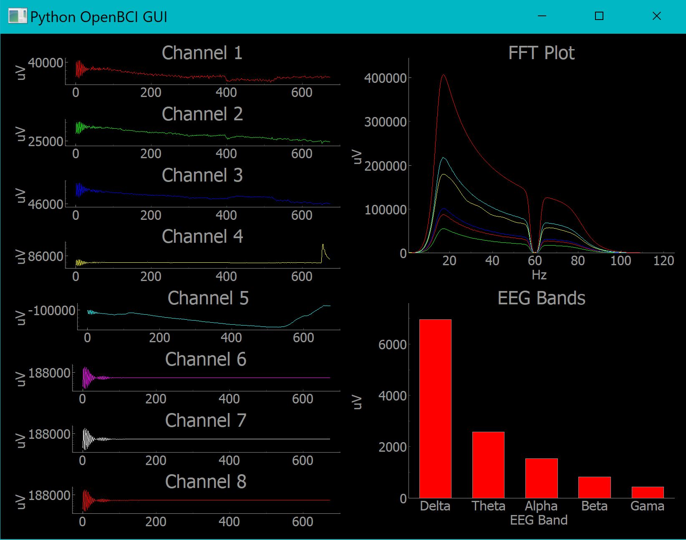

# Plotting live data from Cyton Board using pyOpenBCI and pyqtgraph

This is a very simple way for people starting with the OpenBCI Cyton board to play around with plotting live data, applying some common filters, and getting EEG Bands using the [pyOpenBCI repo](https://github.com/OpenBCI/pyOpenBCI) and [pyqtgraph](http://www.pyqtgraph.org/).

## Objective
1. Use the pyOpenBCI library to aquire data from the OpenBCI board and plot it in real time.
2. Process the OpenBCI data to get the different EEG bands (Alpha, Beta, etc..)

## Why use pyqtgraph?

From the pyqtgraph website:

"PyQtGraph is a graphics and user interface library for Python that provides functionality commonly required in engineering and science applications. Its primary goals are 1) to provide fast, interactive graphics for displaying data (plots, video, etc.) and 2) to provide tools to aid in rapid application development (for example, property trees such as used in Qt Designer).

For plotting, pyqtgraph is not nearly as complete/mature as matplotlib, but runs much faster. Matplotlib is more aimed toward making publication-quality graphics, whereas pyqtgraph is intended for use in data acquisition and analysis applications."

Because the Cyton Board data comes at a rate of 250Hz, a fast way to display data is needed and pyqtgraph is the way to go.

### What you should see:

At the end of this tutorial you should be able to get the OpenBCI data and plot it live like the image below. You should also be able to apply a notch filter and a bandpass filter to the live OpenBCI data. The tutorial is meant to help you understand how to use the pyOpenBCI repo, so if you have any questions feel free to open and issue.

### Notes:
1. This notebook is being run on a Windonws 10 Laptop, using a Python3 environment. This notebook was also tested on a Linux VM.
